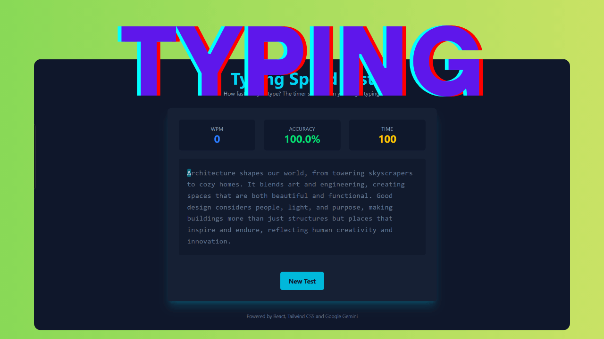

# ⌨️ Typing Speed Test

A modern, responsive web application for testing and improving typing speed, built with React and Vite. This project provides a clean, intuitive interface with real-time speed tracking and AI-powered text generation.



## ✨ Features

- **⚡ Real-time Speed Tracking**: Instant WPM (Words Per Minute) and accuracy calculations
- **🤖 AI-Generated Text**: Integrated with Google's Gemini API for diverse typing content
- **📊 Live Statistics**: Real-time tracking of speed, accuracy, and errors
- **🔄 Restart Functionality**: Quick reset for multiple practice sessions
- **📱 Responsive Design**: Beautiful, modern UI that works on desktop and mobile devices
- **⌨️ Smart Input Tracking**: Accurate keystroke monitoring and error detection
- **⚡ Fast Performance**: Built with Vite and React for optimal performance
- **🎯 React Hooks**: Custom hooks for game logic management

## 🚀 Quick Start

### Prerequisites

- Node.js (version 18 or higher)
- npm or yarn package manager
- Google Gemini API key

### Installation

1. **Clone the repository**

   ```bash
   git clone https://github.com/sainath-666/Typing_Speed_Test.git
   cd Typing_Speed_Test
   ```

2. **Install dependencies**

   ```bash
   npm install
   ```

3. **Set up your API key**

   Create a `.env` file in the root directory:

   ```env
   VITE_GEMINI_API=your_gemini_api_key_here
   ```

   To get your API key:

   - Visit [Google AI Studio](https://makersuite.google.com/app/apikey)
   - Create a new API key
   - Copy the key to your `.env` file

4. **Start the development server**

   ```bash
   npm run dev
   ```

5. **Open your browser**

   Navigate to `http://localhost:5173` to see the application running.

## 🛠️ Available Scripts

- `npm run dev` - Start development server
- `npm run build` - Build for production
- `npm run preview` - Preview production build
- `npm run lint` - Run ESLint for code quality

## 📁 Project Structure

```
src/
├── components/           # React components
│   ├── RestartButton.jsx    # Restart game button
│   ├── Spinner.jsx         # Loading spinner
│   ├── StatsDisplay.jsx    # Speed and accuracy stats
│   └── TypingArea.jsx      # Main typing interface
├── hooks/               # Custom React hooks
│   └── useTypingGame.js    # Game logic and state management
├── services/           # External services
│   └── geminiService.js    # Google Gemini AI integration
└── styles/            # CSS styles
    └── index.css      # Global styles
```

## 🔧 Configuration

### Development

The application is built with modern web technologies and follows best practices:

- **React Hooks**: Custom hooks for game state management
- **Component Structure**: Modular and reusable React components
- **API Integration**: Google's Gemini API for text generation
- **Performance**: Vite for fast development and optimized builds

### Environment Variables

| Variable          | Description            | Required |
| ----------------- | ---------------------- | -------- |
| `VITE_GEMINI_API` | Your Google AI API key | Yes      |

## Tech Stack

- React
- Vite
- Google Gemini AI API
- ESLint

## 🎯 Usage

1. **Start Test**: Begin typing as soon as the text appears
2. **View Stats**: Monitor your WPM and accuracy in real-time
3. **Finish Test**: Complete the given text to see final results
4. **Restart**: Click the restart button to try again with new text

## 🎨 UI Components

### Main Interface

- **Text Display**: Shows the text to be typed
- **Input Area**: Where users type the text
- **Stats Display**: Shows WPM, accuracy, and time
- **Restart Button**: Resets the game with new text

## 🔒 Security & Privacy

- API keys are stored in environment variables
- No user data is stored
- Follows Google's AI safety guidelines

## 🚀 Deployment

### Build for Production

```bash
npm run build
```

The built files will be in the `dist/` directory, ready for deployment to any static hosting service.

### Deploy to Vercel

1. Install Vercel CLI: `npm i -g vercel`
2. Run: `vercel`
3. Add your environment variables in the Vercel dashboard

### Deploy to Netlify

1. Connect your GitHub repository to Netlify
2. Set build command: `npm run build`
3. Set publish directory: `dist`
4. Add environment variables in Netlify dashboard

## 🤝 Contributing

1. Fork the repository
2. Create a feature branch: `git checkout -b feature/amazing-feature`
3. Commit your changes: `git commit -m 'Add amazing feature'`
4. Push to the branch: `git push origin feature/amazing-feature`
5. Open a Pull Request

## 📝 License

This project is licensed under the MIT License - see the [LICENSE](LICENSE) file for details.

## 🙏 Acknowledgments

- [Google Generative AI](https://ai.google.dev/) for text generation
- [React](https://reactjs.org/) for the framework
- [Vite](https://vitejs.dev/) for the build tool

## 📞 Support

If you encounter any issues or have questions:

1. Check the [Issues](https://github.com/sainath-666/Typing_Speed_Test/issues) page
2. Create a new issue with detailed information
3. Include your Node.js version and any error messages

## 🔄 Changelog

### Version 0.0.0

- Initial release
- Basic typing test functionality
- Real-time statistics
- AI-powered text generation
- Responsive design

---

**Note**: This project uses the Google Gemini API for text generation. Please ensure you follow Google's terms of service and API usage guidelines.
